# My Training Blog

## General Information

This is a blog for training purposes. You can register accounts and post information and traning tips for others to see. You can also comment on other posts. Like them and unlike them. You can also edit and delete your own posts. You can also upload training pictures. Link to the live site can be found [here](https://letstrain.herokuapp.com/).

## Table of Contents

- [My Training Blog](#my-training-blog)
  - [General Information](#general-information)
  - [Table of Contents](#table-of-contents)
  - [Project Goals](#project-goals)
  - [User Goals](#user-goals)
  - [User Stories](#user-stories)
    - [Start](#start)
  - [Structure](#structure)
  - [Database Model](#database-model)
  - [Wireframes](#wireframes)
  - [Color Scheme](#color-scheme)
  - [Features](#features)
    - [General Features](#general-features)
    - [Home Page](#home-page)
    - [About Page](#about-page)
    - [Post Detail Page](#post-detail-page)
    - [Add Post Page](#add-post-page)
    - [Edit Post Page](#edit-post-page)
    - [Delete Post Page](#delete-post-page)
    - [Comment Post Page](#comment-post-page)
    - [Delete Comment Page](#delete-comment-page)
    - [Login Page](#login-page)
    - [Register Page](#register-page)
    - [404 Page](#404-page)
  - [Technologies Used](#technologies-used)
    - [Languages](#languages)
    - [Frameworks, Libraries \& Programs](#frameworks-libraries--programs)
    - [Packages](#packages)
    - [Databases](#databases)
    - [Tools Used](#tools-used)
  - [Testing](#testing)
    - [Final Result](#final-result)
  - [Deployment](#deployment)
    - [Deploying to Heroku](#deploying-to-heroku)
  - [Buggs](#buggs)
  - [Future Features](#future-features)
  - [Credits](#credits)
    - [Content](#content)
    - [Media](#media)
    - [Code](#code)
    - [Acknowledgements](#acknowledgements)

## Project Goals

- Is to create a blog where people can post training tips and information. Also to create a community where people can share their training experiences and help each other out.
- Structure the site in a way that is easy to navigate and use.
- Site user can register an account and login to the site. And be able to post information and training tips for others to see.
- Site user can comment on other posts. Like them and unlike them.
- Responsive on all device sizes.

## User Goals

- As site Admin I want to manage the site and be able to delete posts and comments.
- As a site user I want to be able to register an account and login to the site.
- As a site user I want to be able to post information and training tips for others to see.
- As a site user I want to be able to comment on other posts. Like them and unlike them.

## User Stories

GitHub projects was used as my project management tool to track user stories.

### Start
I will implement more user stories as I go along. I will also add more features to the site as I go along.

I was able to get the first three user story's done. Then the rest followed after that.

## Structure

The website has been organized in a Hierarchical Tree Structure to ensure the site user navigates through the site effortlessly and intuitively.

- Home
  - The home page is the first page the user will see when they visit the site. It contains a navigation bar at the top of the page. The navigation bar contains a link to the home page, login page, register page, and logout. The home page also contains a search bar and a button to create a post. The home page also contains a list of posts. Each post contains a title, author, date, and a like button. The home page also contains a footer with links to social media. You can also edit and delete your own posts.
  
- Post Detail
  - Post Detail is a page that contains the post title, author, date, and the post content. The post detail page also contains a like button and a comment section. The comment section contains a form to add a comment and a list of comments. Each comment contains the author, date, and comment content. You can also edit and delete your own comments.

- Create Post
  - Create Post is a page that contains a form to create a post. The form contains a title field, content field, and an image field. The image field is optional. The create post page also contains a cancel button. The cancel button will take you back to the home page.

- Edit Post
  - Edit post is a page that contains a form to edit a post. The form contains a title field, content field, and an image field. The image field is optional. The edit post page also contains a cancel button. The cancel button will take you back to the home page.

- Delete Post
  - Delete post is a page that contains a form to delete a post. Gives you a options if you want delete your own post. The delete post page also contains a cancel button. The cancel button will take you back to the home page.

- Edit Comment
  - Edit comment is a page that contains a form to edit a comment. The form contains a content field. So you can update your comment.
  
- Delete Comment
  - Delete comment works as the delete post page. It contains a form to delete a comment. Gives you a options if you want delete your own comment. The delete comment page also contains a cancel button. The cancel button will take you back to the home page.

- Login
  - Login is a page that contains a form to login to the site. The form contains a username field and a password field. The login page also contains a cancel button. 
  
- Register
  - Register is a page that contains a form to register an account. The form contains a username field, email field, password field, and a confirm password field. The email field is optional. You must be registered to post and comment on the site.

- Logout
  - Is a button that will log you out of the site. It will ask you if you are sure the sign out. And redirect you to the home page.

- A 404 page has been added to the site. If you try to access a page that does not exist. It will redirect you to the 404 page. And option to go back to the home page.
  
- About Page
  - The about page contains information about the site and the site owner and goals.

## Database Model

The type of database being used for the is relational database being managed using PostgreSQL.

I used  link https://drawsql.app/ to create the database model.

Comment Model

- Comment A foreign key to the post model. So each comment is linked to a post.
- Author A foreign key to the user model. So each comment is linked to a user. With a foreign key to the user model.
- Body The content of the comment.
- Created_on The date the comment was created.
- Last update_on The date the comment was updated.
- And a count on the comment model. To count the number of comments on a post.
Post Model

- Title The title of the post. Provided by the author.
- Author store the author of the post. A foreign key to the user model.
- Content The content of the post. Provided by the author.
- Slug A slug is to create a unique URL for each post.
- Created_on The date the post was created.
- Last update_on The date the post was updated.
- Liked A many to many field to the user model. So each post can be liked by a user.

## Wireframes

Balsamiq has been used to showcase the appearance of the site and display structure.

Here is my wireframes for the site.

I picture the site to be a dark theme with a light theme for the text. This is to make the site more appealing to the eye and to make the text more readable. Simple and easy to use. And easy to navigate.

Here is the landing page.

And the post detail page.

And the add post page.

Simple adn effective wireframes. And I hade a good idea of what I wanted the site to look like.

## Color Scheme

The color scheme has been chosen to be a dark theme for header and footer a light theme for the body. This is to make the site more appealing to the eye and to make the text more readable. So you can focus on the content.

For the header and footer I used a darker color #212529;
For the buttons I used a lighter color #6c757d;
And white for the background color #fff; So the pictures/content will stand out. And be in focus.
All the social links and links on the header is #0d6efd; For a more pop out effect.

## Features

### General Features

- The website has been designed from a mobile first perspective.
- Site is responsive and will adapt to different screen sizes.
- Navigation bar is fixed to the top of the page.
- Search bar is available on all pages.
- Footer is available on all pages. And contains links to social media.

A easy to use and navigate site. With a simple and effective design.

On the site you have a search bar. So you can search for a post.

And a footer with links to social media.

### Home Page

- The home page contains a list of all the posts on the site.
- Home page has a search bar. So you can search for a post.
- You can click on the post to view the post detail page.
- Depending if you are logged in or not. You will see different options.
- You can like a post if you are logged in.
- Comment on a post if you are logged in.
- And edit or delete a post if you are logged in and the post is yours.
- Below the list of posts is a pagination bar. So you can navigate between pages. After 6 posts.

### About Page

- The about page contains information about the site and the site owner and goals.

### Post Detail Page

- The post detail page contains the post title, author, content, and date created.
- Options to like the post, comment on the post, edit the post, and delete the post.
- If you are not logged in you will not see the options to like, comment, edit, and delete the post.
- You can only delete post if you are logged in and the post is yours.

### Add Post Page

- The add post page contains a form to add a post.
- You must be logged in to add a post.

### Edit Post Page

- The edit post page contains a form to edit a post.
- You must be logged in to edit a post.
  
### Delete Post Page

- The delete post page contains a form to delete a post.
- You must be logged in to delete a post.

### Comment Post Page

- The comment post page contains a form to comment on a post.
- You must be logged in to comment on a post.

### Delete Comment Page

- The delete comment page contains a form to delete a comment.
- You must be logged in to delete a comment.

### Login Page

- The login page contains a form to login.
- If you dont have an account you can click on the link to register.
  
### Register Page

- The register page contains a form to register.

### 404 Page

- The 404 page contains a message that the page does not exist.

  

## Technologies Used

### Languages

- HTML5
- CSS3
- Python
- JavaScript

### Frameworks, Libraries & Programs

- Django
  - Django is a high-level Python Web framework that encourages rapid development and clean, pragmatic design.
- Django Templates
  - Django templates are used to render the data from the backend to the frontend.
- Font Awesome
  - Font Awesome is a font and icon toolkit based on CSS and LESS.
- Bootstrap
  - Bootstrap is a free and open-source CSS framework directed at responsive, mobile-first front-end web development.
- jQuery
  - jQuery is a JavaScript library designed to simplify HTML DOM tree traversal and manipulation, as well as event handling, CSS animation, and Ajax.
- Google Fonts
  - Google Fonts is a library of 1080 free licensed font families and APIs for conveniently using the fonts via CSS and Android.
- Font Awesome
  - Font Awesome is a font and icon toolkit based on CSS and LESS.

### Packages

- Gunicorn
  - Gunicorn was used as Python WSGI HTTP Server for UNIX to support the deployment of Django application.

- SummerNote
  - SummerNote is a JavaScript library that allows you to create a WYSIWYG editor.

- Cloudinary
  - Cloudinary is a cloud-based image and video management service.
  
- Allauth
  - Allauth is a Django application that takes care of user registration, authentication, account management as well as 3rd party (social) account authentication.
  
- Django Crispy Forms
  - Crispy Forms is a Django application that allows you to control the form rendering behavior in your templates.

### Databases

- ElephantSQL
  - ElephantSQL is a PostgreSQL database as a service. It is a cloud-based database that is managed by the vendor.

- Heroku
  - Heroku Postgres database was used in production, as a service based on PostgreSQL provided by Heroku.

### Tools Used

- Git
  - Git was used for version control by utilizing the Gitpod terminal to commit to Git and Push to GitHub.

- GitHub
  - GitHub is used to store the project code after being pushed from Git.
  
- Gitpod
  - GitPod was used for writing code, committing, and then pushing to GitHub.

- Balsamiq
  - Balsamiq was used to create the wireframes during the design process.
  
- Am I Responsive
  - Am I Responsive was used to preview the website across a variety of popular devices.

- Chrome DevTools
  - Chrome DevTools was used to test the website across a variety of popular devices.

- W3C Markup Validation Service
  - W3C Markup Validation Service was used to validate the HTML code.

- W3C CSS Validation Service
  - W3C CSS Validation Service was used to validate the CSS code.

- JSHint
  - Used to validate the JavaScript code.

- Heroku
  - To deploy the project.

- Chrome DevTools
  - To test the website across a variety of popular devices.

## Testing

Testing information can be found in a separate file [here](TESTING.md).

### Final Result

The final result can be viewed [here](https://my-training-blog.herokuapp.com/).

See screenshots of the website below:

1.

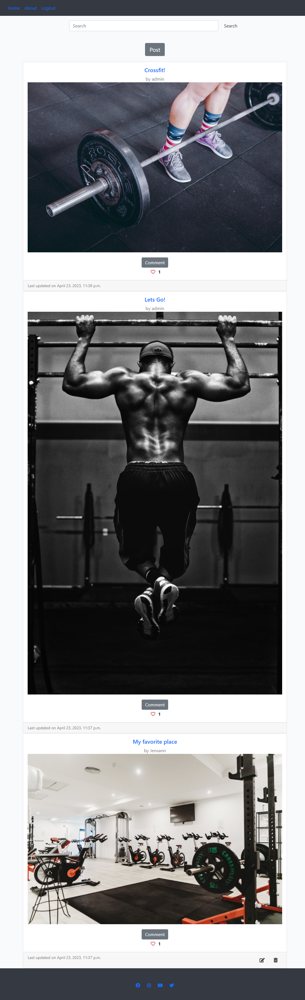

2.

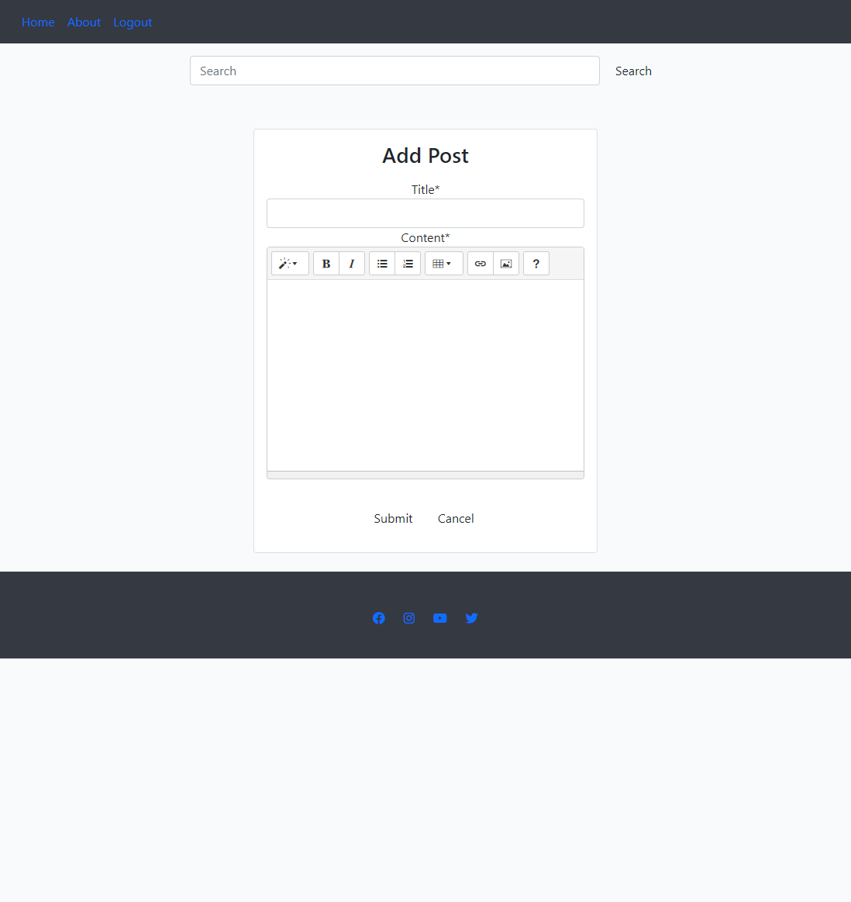

3.

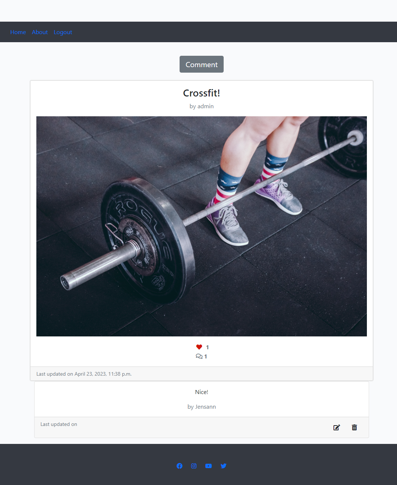

4.

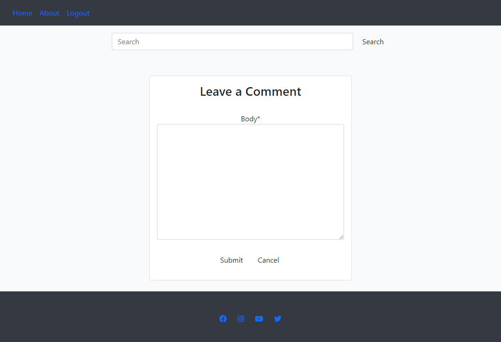

5.

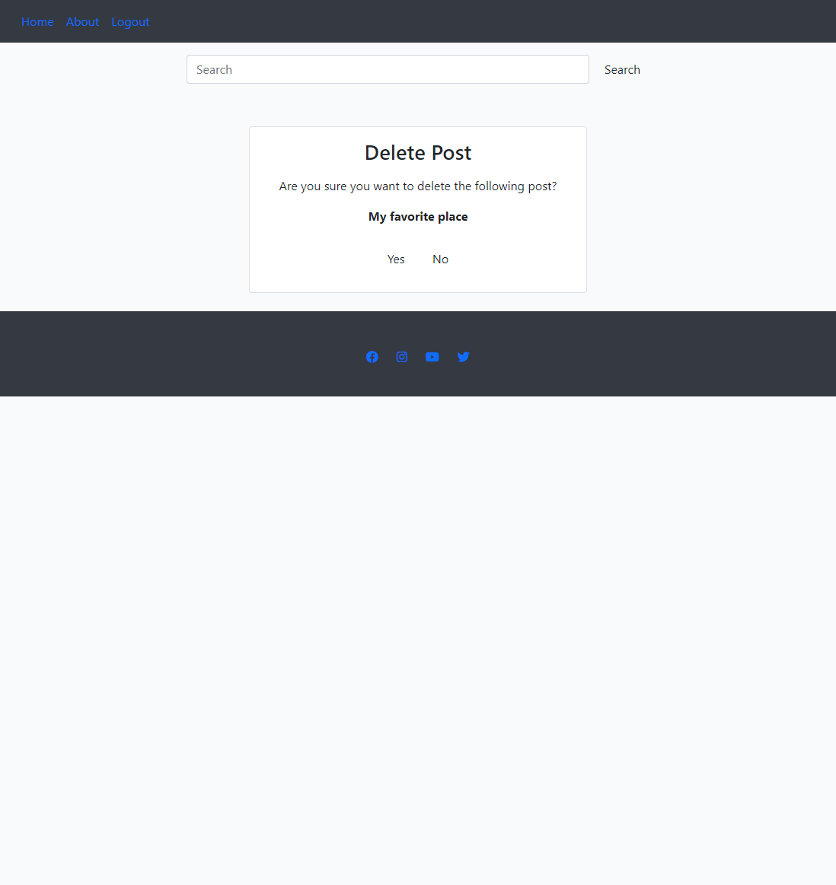

6.

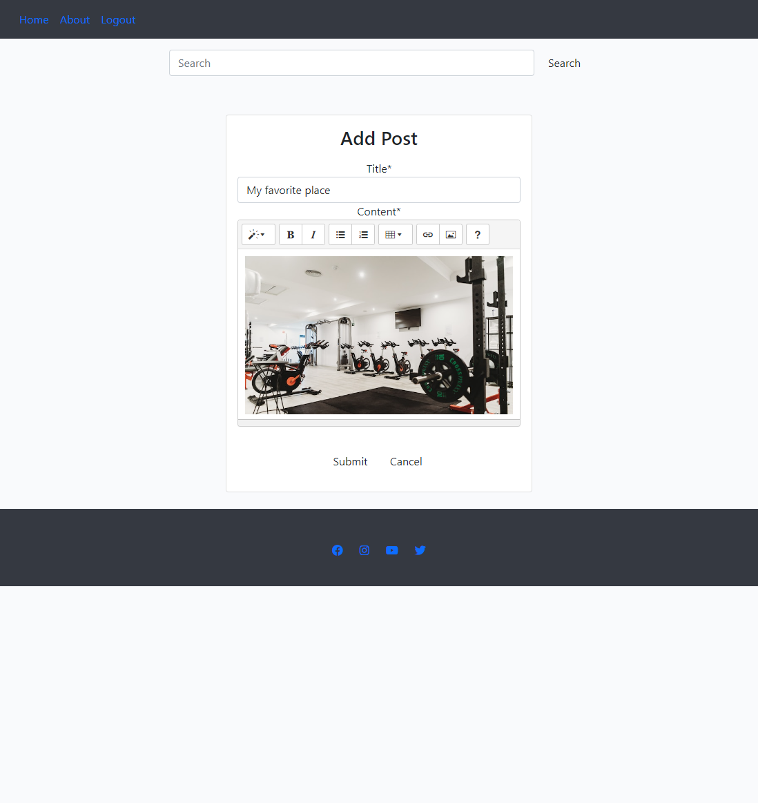

7.

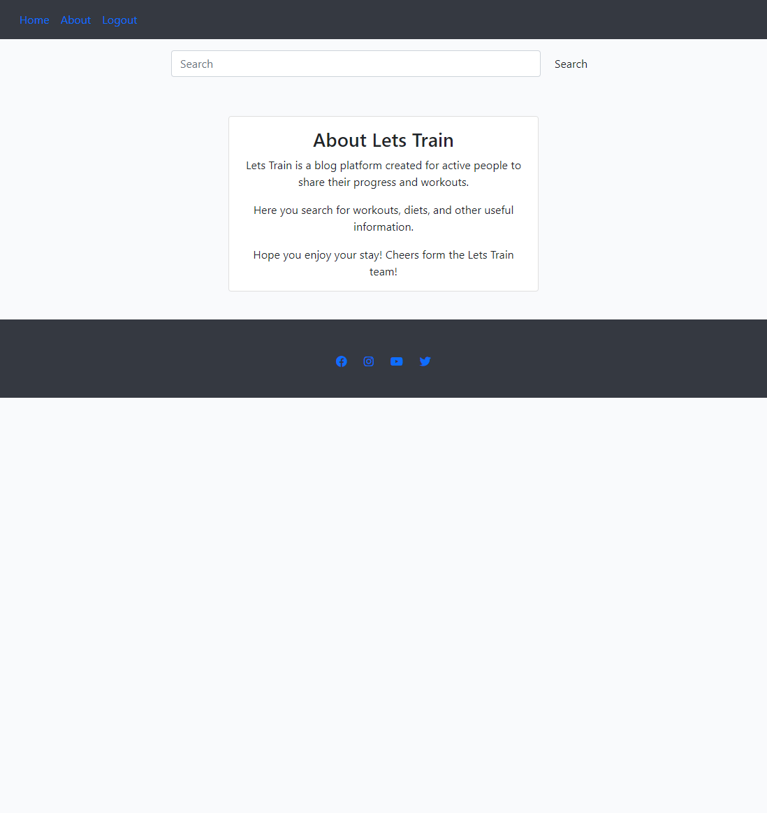

For mobile devices:

1.

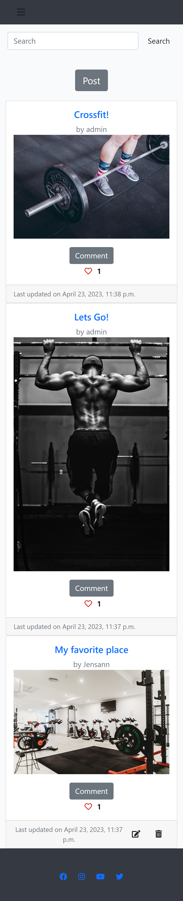

2.

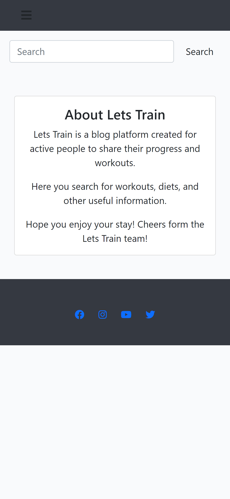

3.

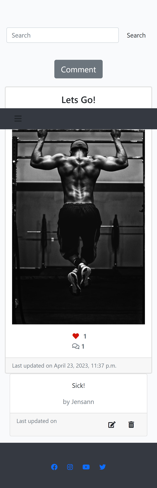

4.

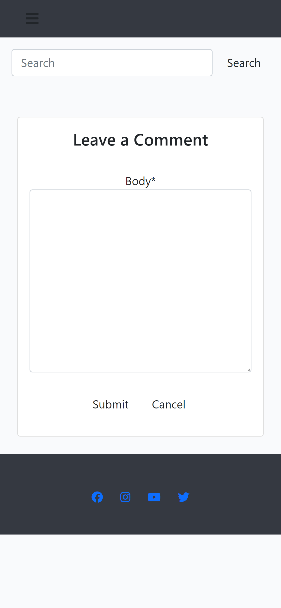

5.

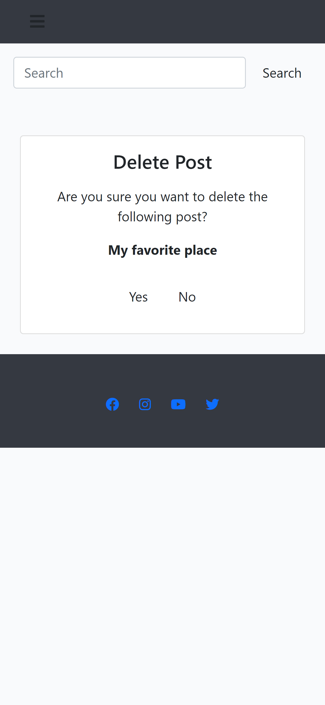

6.

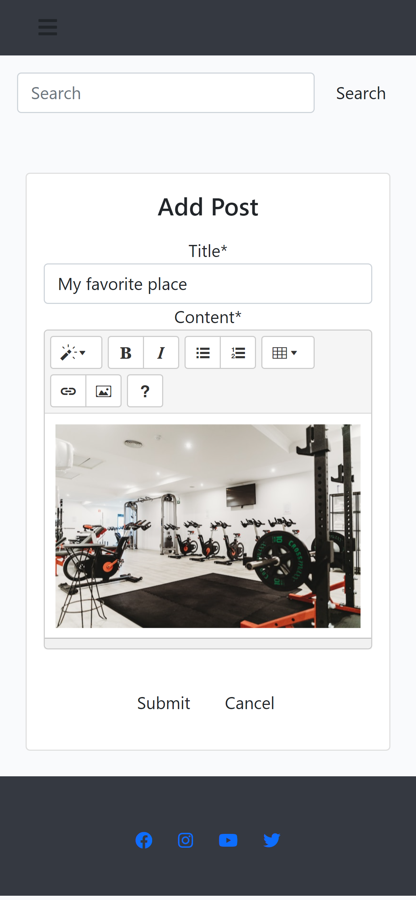

7.

## Deployment

### Deploying to Heroku

The project was deployed to Heroku using the following steps:

1. Create a requirements.txt file using the terminal command `pip3 freeze --local > requirements.txt`
2. Create a Procfile for connecting to Heroku with web gunicorn my_training_blog.wsgi

3. Push the requirements.txt and Procfile to GitHub.

4. Create a env.py and added os.environ.get("SECRET_KEY") and os.environ.get("CLOUDINARY_URL") and os.environ.get("DATABASE_URL")

4. Create a new app on Heroku, give it a name, and set the region to Europe.

5. Go to settings and click on "Reveal Config Vars".
   - Set the following config vars:
   - CLOUDINARY_URL and copy url from cloudinary
   - DATABASE_URL and copy the url from Elphantsql that was created from a new instance
   - SECRET_KEY added the secret key from env.py
   - Added PORT and set it to 8000
   - Added DISABLE_COLLECTSTATIC and set it to 1 just for the app to deploy. I removed it when the app was done.

6. In settings.py, set the following:
   - ALLOWED_HOSTS = ['my-training-blog.herokuapp.com', 'localhost']
   - DATABASES = {'default': dj_database_url.parse(os.environ.get('DATABASE_URL'))}
   - STATICFILES_STORAGE = 'cloudinary_storage.storage.StaticHashedCloudinaryStorage'
   - STATICFIELS_DIRS = [os.path.join(BASE_DIR, 'static')]
   - STATIC_ROOT = os.path.join(BASE_DIR, 'staticfiles')
   - MEDIA_URL = '/media/'
   - DEFUALT_FILE_STORAGE = 'cloudinary_storage.storage.MediaCloudinaryStorage'
   - Added in templates directory to the TEMPLATES DIRS
   - In the INSTALLED_APPS added cloudinary and cloudinary_storage
   - Added in the screect key from env.py SECRET_KEY = os.environ.get('SECRET_KEY')
   - Added import os
import dj_database_url
if os.path.isfile('env.py'):
    import env

7. Go to the Deploy tab and select GitHub as the deployment method. Click on Deploy branch. Wait to the build is complete. And open the app with the Open App button. Link to the live site can be found [here](https://letstrain.herokuapp.com/).

## Buggs

- A known issue with Summernote field validation is present in the project. An invalid form will be posted if the field is empty. A message will however be displayed, informing the user that there has been a problem with the submission.

## Future Features

- Add a email validation to the sign up form.
- Add more content to the blog.
- Add more features to the blog. As liking comments displaying number of views.
- Add a recommendation system to the blog. For the most liked/commented posts.
- Add profile picture to the user profile page.
- Better forms.
- Editing and deleting your own profile.
- Add more sidebars with more information. And popular posts.

## Credits

### Content
- Website content was written by the developer.

### Media

- The photos used in this site were obtained from [Unsplash](https://unsplash.com/).

### Code
- Stack Overflow was used to help with the code. and W3Schools. were consulted for code examples. And regular basis for inspiration.. To better understand the code and how to implement it.

### Acknowledgements

- My mentor Marcel for continuous helpful feedback.

- My fiancee for her support and encouragement.

Back to [top](#table-of-contents)