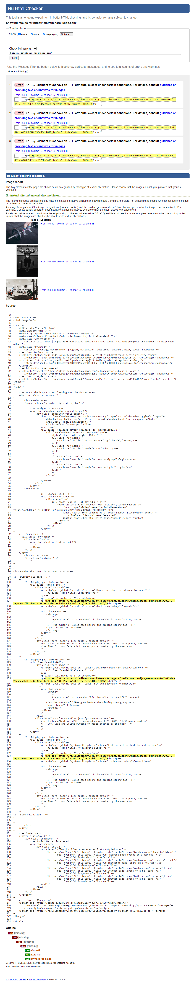
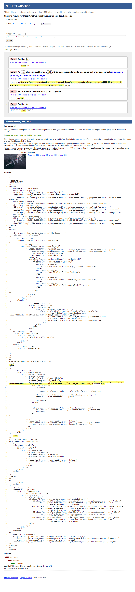
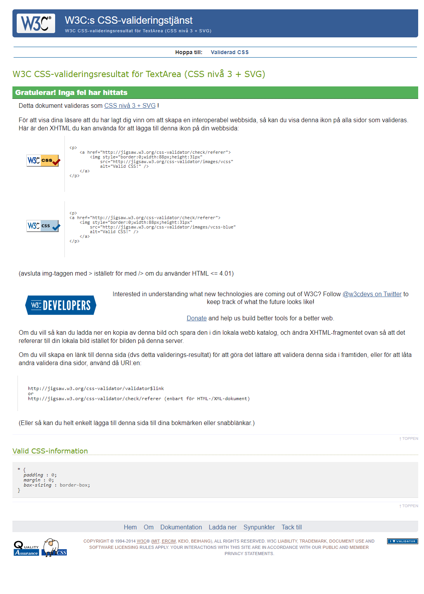

# Code Buddy Testing

[Back to the README.md file](https://github.com/jensalindgren/blog)  

[Back to the Testing section in the README.md file](https://github.com/jensalindgren/blog#deploying-to-heroku)

[View the live website here](https://letstrain.herokuapp.com/)  

## Table of Contents

1. [Testing User Stories](#testing-user-stories)
2. [Code Validation](#code-validation)
3. [Accessibility](#accessibility)
4. [Tools Testing](#tools-testing)
5. [Manual Testing](#manual-testing)

## Testing User Stories

### 1. As a Site Admin I can create, read, update and delete post and answers so that I can manage the site content

* An admin site has been provided so that the Site Admin can manage the site content.

* Pages for creating, reading, updating and deleting posts and comments are provided.

* Post and comment main fields are being displayed for the Site Admin to identify them easily.

* Post and comment can be filtered and searched to narrow down a specific group.

### 2. As a Site User I can register an account so that I can post and comment on the site

* Account registration has been provided for Site User.

* Registered Site Users are given the possibility to submit pictures or other content to the site.

* Registered Site Users are able to edit and delete their own post and comments.

### 3. As a Site User I can create new post so that I can share my knowledge with other users

* Add post page has been provided for registered Site Users.

* A form is available in the add post page for the Site Users to be able to add new content to the site.

* Add post button is displayed to the registered Site Users at the top of the content list.

### 4. As a Site User I can edit and delete my own post so that I can manage the content I created

* Edit and Delete post pages are provided for registered Site Users.

* A form is available inside those pages for the Site Users to be able to edit or delete a specific post.

* A Delete post form is provided for Site Users to confirm the deletion.

* Edit and Delete button are displayed on those post the user has created to access the respective page.

### 5. As a Site User I can comment to post so that I can be part of the movement

* A comment page has been provided for registered Site Users.

* A form is available to comment page for the Site Users. So the comment on the post the like or not.

* A Leave comment button is displayed to all the user but it will only take you to de detail page and no comment will be added.

* I must be logged in to be able to comment on a post.

### 6. As a Site User I can edit and delete my own comment so that I can manage the content I created

* Edit and Delete comment pages are provided for registered Site Users.

* A form is available inside those pages for the Site Users to be able to edit or delete a specific comment

* A Delete comment form is provided for Site Users to confirm the deletion.

* Edit and Delete button are displayed on those comment the user has created to access the respective page.

### 7. As a Site User I can like and dislike post so that I can show my appreciation

* A Like and Dislike button is provided for all Site Users.

* The Like button is only available for registered Site Users.
  
* You can like a post only once. When you click on the like button it will unlike the post.

### 8. As a Site User I can view a search of post so that I can select one I like most

* The Home page is a post List, displaying all existing post to all Site Users.

* All the post will be displayed in newest first order.

* I can search for a specific post using the search bar at the top of the page.

* I can search for keywords in the post title or the post content.

* It will display a list of post that match the search criteria.

### 10. As a Site User I can view a paginated list of post

* The Post List displayed in the Home page is paginated every 6 post.

* Navigation buttons are provided on the bottom of each page to navigate easily between pages.

### 11. As a Site User I can click on a post so that I can read the full post and its content with comments and likes received

* A  post detail page is provided for all Site Users to review the full post content.

### 12. As a Site User I can view the comment on post received so that can be part of the conversation

* Comment's are being listed inside the post detail page for each specific post under the post content.

* Comments are be sorted after newest first.

## Code Validation

### HTML

The [W3C Markup Validator](https://validator.w3.org/) was used to validate the HTML code.
 
Home page!

Only showed warnings for the picture I stored on cloudinary. No other errors were found.

I think the problem with picture is comming Summernote editor.

Post detail page!

Found some </ br > was causing problems I fixed it.

### CSS

W3C CSS Validator was used to validate the CSS code. https://jigsaw.w3.org/css-validator/

No problem from the css.

