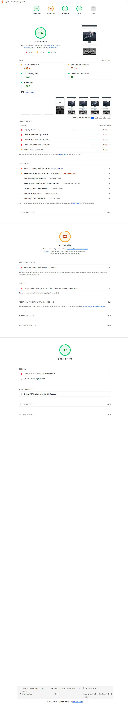
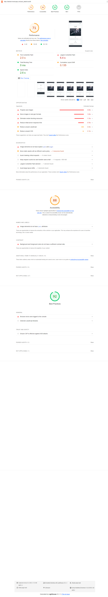
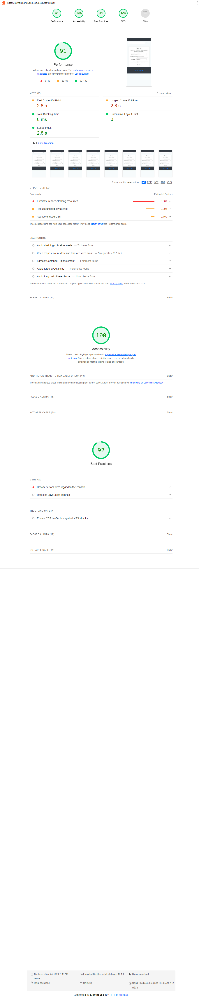
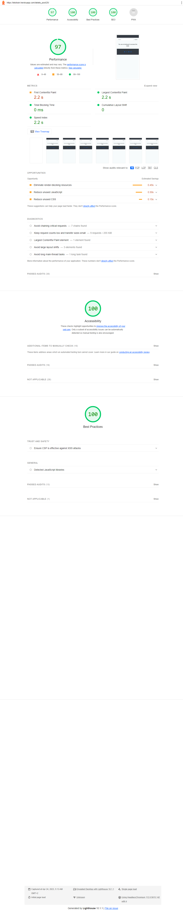
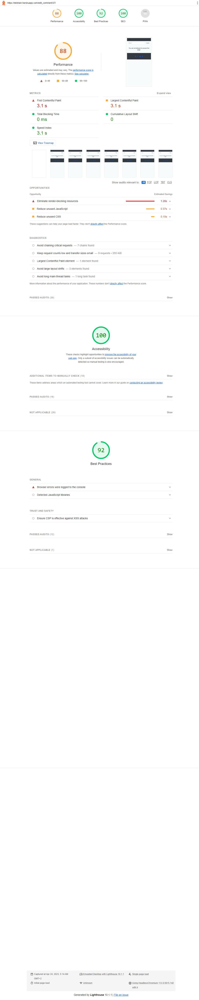

# Code Buddy Testing

[Back to the README.md file](https://github.com/jensalindgren/blog)  

[Back to the Testing section in the README.md file](https://github.com/jensalindgren/blog#deploying-to-heroku)

[View the live website here](https://letstrain.herokuapp.com/)  

## Table of Contents

1. [Testing User Stories](#testing-user-stories)
2. [Code Validation](#code-validation)
3. [Accessibility](#accessibility)
4. [Tools Testing](#tools-testing)
5. [Manual Testing](#manual-testing)

## Testing User Stories

### 1. As a Site Admin I can create, read, update and delete post and answers so that I can manage the site content

* An admin site has been provided so that the Site Admin can manage the site content.

* Pages for creating, reading, updating and deleting posts and comments are provided.

* Post and comment main fields are being displayed for the Site Admin to identify them easily.

* Post and comment can be filtered and searched to narrow down a specific group.

### 2. As a Site User I can register an account so that I can post and comment on the site

* Account registration has been provided for Site User.

* Registered Site Users are given the possibility to submit pictures or other content to the site.

* Registered Site Users are able to edit and delete their own post and comments.

### 3. As a Site User I can create new post so that I can share my knowledge with other users

* Add post page has been provided for registered Site Users.

* A form is available in the add post page for the Site Users to be able to add new content to the site.

* Add post button is displayed to the registered Site Users at the top of the content list.

### 4. As a Site User I can edit and delete my own post so that I can manage the content I created

* Edit and Delete post pages are provided for registered Site Users.

* A form is available inside those pages for the Site Users to be able to edit or delete a specific post.

* A Delete post form is provided for Site Users to confirm the deletion.

* Edit and Delete button are displayed on those post the user has created to access the respective page.

### 5. As a Site User I can comment to post so that I can be part of the movement

* A comment page has been provided for registered Site Users.

* A form is available to comment page for the Site Users. So the comment on the post the like or not.

* A Leave comment button is displayed to all the user but it will only take you to de detail page and no comment will be added.

* I must be logged in to be able to comment on a post.

### 6. As a Site User I can edit and delete my own comment so that I can manage the content I created

* Edit and Delete comment pages are provided for registered Site Users.

* A form is available inside those pages for the Site Users to be able to edit or delete a specific comment

* A Delete comment form is provided for Site Users to confirm the deletion.

* Edit and Delete button are displayed on those comment the user has created to access the respective page.

### 7. As a Site User I can like and dislike post so that I can show my appreciation

* A Like and Dislike button is provided for all Site Users.

* The Like button is only available for registered Site Users.
  
* You can like a post only once. When you click on the like button it will unlike the post.

### 8. As a Site User I can view a search of post so that I can select one I like most

* The Home page is a post List, displaying all existing post to all Site Users.

* All the post will be displayed in newest first order.

* I can search for a specific post using the search bar at the top of the page.

* I can search for keywords in the post title or the post content.

* It will display a list of post that match the search criteria.

### 10. As a Site User I can view a paginated list of post

* The Post List displayed in the Home page is paginated every 6 post.

* Navigation buttons are provided on the bottom of each page to navigate easily between pages.

### 11. As a Site User I can click on a post so that I can read the full post and its content with comments and likes received

* A  post detail page is provided for all Site Users to review the full post content.

### 12. As a Site User I can view the comment on post received so that can be part of the conversation

* Comment's are being listed inside the post detail page for each specific post under the post content.

* Comments are be sorted after newest first.

## Code Validation

### HTML

The [W3C Markup Validator](https://validator.w3.org/) was used to validate the HTML code.
 
Home page!

Only showed warnings for the picture I stored on cloudinary. No other errors were found.

I think the problem with picture is comming Summernote editor.

Post detail page!

Found some </ br > was causing problems I fixed it.

### CSS

W3C CSS Validator was used to validate the CSS code. https://jigsaw.w3.org/css-validator/

No problem from the css.

### Python

For my Python code I used PyLint to check for errors. I double checked the code with pycharm and it was not showing any errors.

### JavaScript

I used JSHint to check for errors in my JavaScript code. No errors were found.

## Accessibility

I used light house to check the accessibility of the website. I got okey results. I uploaded the pictures to cloudinary to make the website faster. I think that is the reason why I got a bad result on the performance is that the picture I uploaded to cloudinary is not loading fast enough.

1.

2.

3.

4.

5.

6.

7.

8.

## Tool for testing

Chrome DevTools was used to test the website on different devices and browsers.
And http://ami.responsivedesign.is/# was for responsiveness of the site pages across different devices.

## Manual testing

### Home page

* Tested the navigation bar to make sure it is working properly.
* All the links in the navigation bar are working properly.
* All the links in the footer are working properly. And the social media links are opening in a new tab.
* All the buttons are working properly.
* ALl the content is displayed properly.
* All the right content is displayed for the right user.
* Displayed the post list in the newest first order.
* With the search bar I was able to search for a specific post.
* Data is being displayed in the right order.
* Post author is displayed.
* Likes are displayed.
* All the edit and delete buttons are displayed for the right user.
* * All right message is displayed for the right user.

### Post detail page

* All the buttons are working properly.
* All the content is displayed properly.
* All the right content is displayed for the right user.
* All the comments are displayed.
* All dates are displayed in the right format.
* All likes are displayed.
* All comments are displayed in the right order.
* All edit and delete buttons are displayed for the right user.
* All right message is displayed for the right user.

### Add Post page

* All the buttons are working properly.
* All the content is displayed properly.
* All the content is displayed properly.
* All the form is working properly.
* All the right message is displayed for the right user.
* All the right functionality from the form is working properly.

### Edit Post page

* All the buttons are working properly.
* All the content is displayed properly.
* All the name of the post is displayed.
* All the right message is displayed for the right user.
* All the right tools to edit the post are displayed.
* All the old content is displayed.
* All the right message is displayed for the right user.

### Delete Post page

* All the buttons are working properly.
* All the content is displayed properly.
* All the right message is displayed for the right user.
* All the right functionality from the form is working properly.
* All the content and comments are deleted. And the post is deleted from the database.

### Register page

* All the buttons are working properly.
* All the content is displayed properly.
* All the right message is displayed for the right user.
* All the right functionality from the form is working properly.
* All the right account is created.
  
### Login page

* All the buttons are working properly.
* All the content is displayed properly.
* All the right message is displayed for the right user.
* All the right functionality from the form is working properly.
* All the right account is logged in.
* All the right content is displayed for the right user. And its working properly.
* All the right to add a post comment and like. Edit and delete post is working properly.

### Sign out page

* All the buttons are working properly.
* All the content is displayed properly.
* All the right message is displayed for the right user.
* All the right functionality from the form is working properly.
* All the right account is logged out.

### Comment page

* All the buttons are working properly.
* All the content is displayed properly.
* All the right functionality from the form is working properly.
* All the right comment is added to the post.
* All the right message is displayed from the right user.
* All the right choice is displayed for the right user. So they can edit or delete the comment.

### Edit Comment page

* All the buttons are working properly.
* All the content is displayed properly.
* All the right functionality from the form is working properly.
* All the right comment is edited.
* All the right message is displayed from the right user.
* All the form is working properly.
* All the comment on the specific post on the specific comment is edited.
* All the right comment is edited in the database.

### Delete Comment page

* All the buttons are working properly.
* ALL the content is displayed properly.
* All the right functionality from the form is working properly.
* All the right comment is deleted.
* All the right message is displayed from the right user.
* All the right comment is deleted from the database.

### About page

* All the buttons are working properly.
* All the content is displayed properly.
* All the right message is displayed for the right user.

### 404 page

* All the buttons are working properly.
* All the content is displayed properly.

### Messages

* All the right message is displayed for the right user.
* When they are logged in or logged out.
* Edit or delete a post.
* Edit or delete a comment.
* Add a post or comment.

### Forms 

* All the forms are working properly.
* All the right message is displayed for the right user.
* All the right functionality from the form is working properly.
* All the right ability to add a post or comment is working properly.
* All the right edit and delete functionality is working properly.

[Back to the Testing section in the README.md file](https://github.com/jensalindgren/blog#deploying-to-heroku)